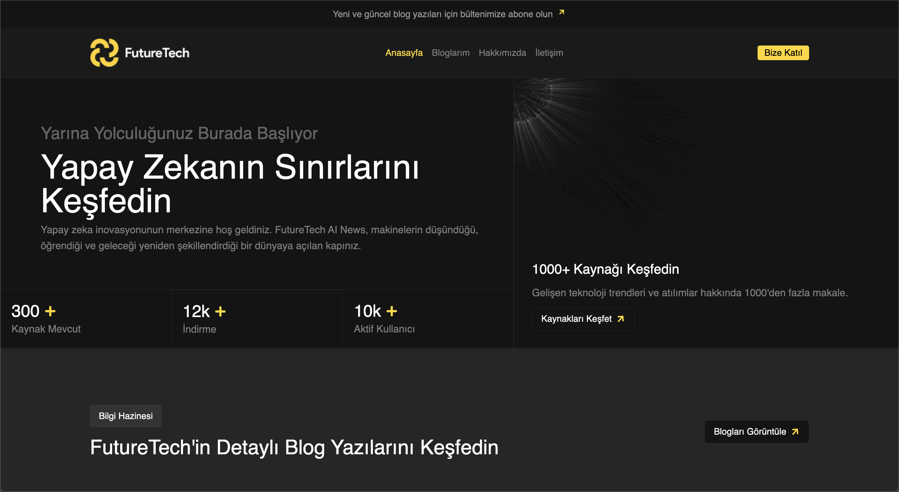
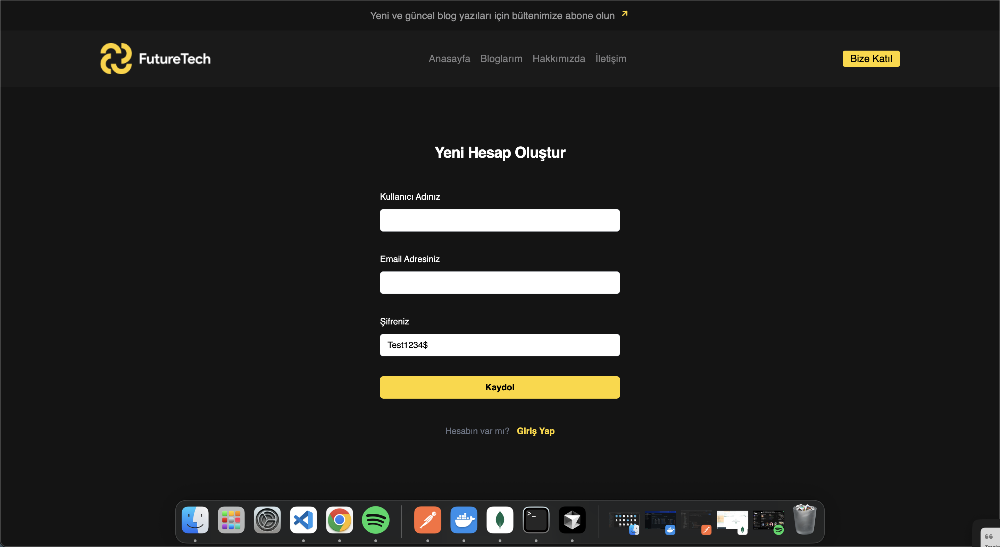
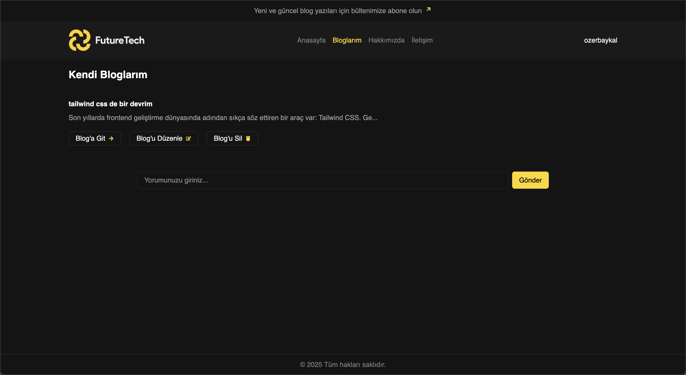
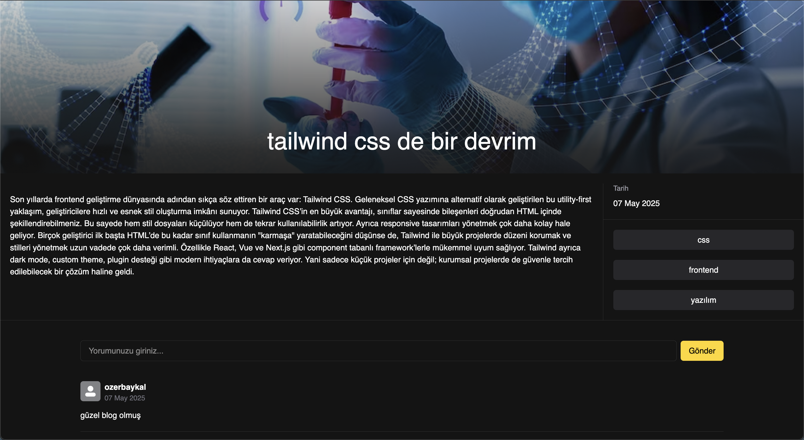

# 📝 Full-Stack Blog Web Application

This is a full-stack blog application that allows users to register, log in, create blog posts, comment, and interact securely using JWT-based authentication.  
The **backend** is built with **NestJS**, and the **frontend** is developed using **React (Vite + TypeScript)**.

📸 Screenshots

## Video gif


## Main Page



## register



## myBlogs



## blogDetail



---

## 🚀 Features

### 🌐 API (NestJS)

- **Authentication**
  - Register & Login
  - Access & Refresh Token handling
- **Authorization**
  - Secure authentication with JWT
  - Route protection using guards
- **User Module**
  - View user profile
  - Update user information
- **Post/Blog Module**
  - Create, edit, delete blog posts
  - Tag support
- **Comment Module**
  - Add and delete comments on blog posts

---

### 💻 Client (React + Vite + TypeScript)

- UI for viewing blogs and comments
- Register & Login pages
- Session management with `Context API`
- API handling via `@tanstack/react-query`
- Forms with validation using `Formik` and `Yup`
- Notifications with `react-toastify`
- Fully styled with `TailwindCSS`
- Routing handled by `react-router-dom`

---

## 🛠️ Technologies Used

### Backend – NestJS

- `@nestjs/common`, `@nestjs/core`, `@nestjs/config`
- `@nestjs/jwt`, `@nestjs/passport`, `passport-jwt`, `passport-local`
- `@nestjs/mongoose`, `mongoose`
- `class-validator`, `class-transformer`
- `bcrypt`, `cookie-parser`, `helmet`, `cors`

### Frontend – React (Vite + TS)

- `@tanstack/react-query`
- `axios`
- `formik`, `yup`
- `react-router-dom`, `react-icons`, `react-select`
- `react-toastify`
- `tailwindcss`, `@tailwindcss/vite`

---

---

## 🧪 Getting Started

- Clone the project to your local machine:
  git clone https://github.com/ozerbaykal/blogApp-nest-full-stack.git

### 1️⃣ Backend (API)

```bash
cd api
npm install
npm run start:dev

cd client
npm install
npm run dev

🔐 Authentication Flow
Access Token is stored in HTTP-only cookie

Refresh Token is used to get a new access token when expired (/auth/refresh)

Tokens are managed through axios interceptors for a seamless experience

Unauthorized users are redirected to login using Context API


Özer Baykal


Contributions are welcome! Please open an issue first to discuss what you would like to change.

- 1.Fork the project
- 2.Create your feature branch (git checkout -b feature/NewFeature)
- 3.Commit your changes (git commit -m 'Add new feature')
- 4.Push to the branch (git push origin feature/NewFeature)
- 5.Open a Pull Request

<h2>Contact</h2>
👨‍💻 Developer
Özer BAYKAL mail : baykalozer87@gmail.com

Project Link:https://github.com/ozerbaykal/blogApp-nest-full-stack.git

```
